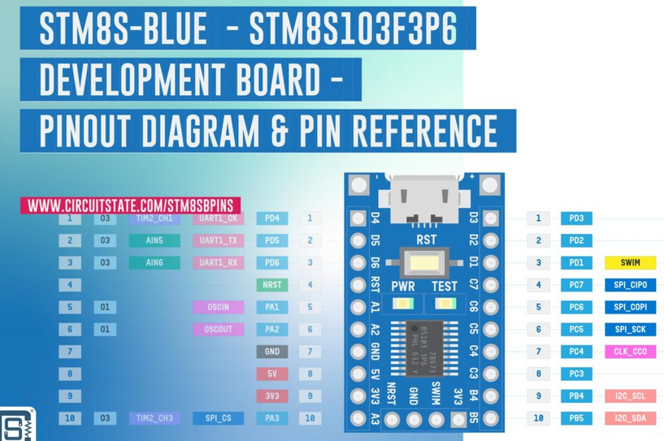
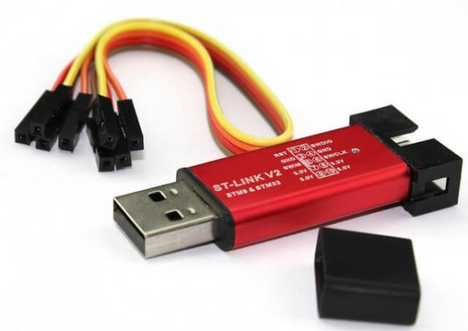

# STM8
stm8 programming tools and examples



### Введение

Эти платы я купил на AliExpress и попытался их как-то использовать в своих самоделках. Чипы на таких платах уже залочены от модификации и никакого blink там изначально нет.
Обозначения пинов на этой плате делал бухой китаец, поэтому рекомендую не верить надписям на плате, а проверять все пины по картинке выше.
Немного поигравшись с этими платами, я убедился в их бесполезности для моих целей. 8 КБ флеш памяти - это очень мало и эта память при использовании компилятора SDCC и программирования на языке "С" очень быстро заканчивается. На ассемблере вам памяти должно хватить, но вряд ли хватит терпения :)
Не смотря на то, что у SDCC есть опции поддержки с++ стандарта 23, на практике ничего выше обычного "С" не поддерживается. Приколов добавляет также своя специфика SDCC, что иногда превращает программирование в поиск правильного пути вслепую. Структуры он 100% не умеет передавать по значению.

Я использую Ubuntu linux 20.04 x86_64. Вся настройка среды программирования была интересна только под линукс.

### Подготовка к прошивке

Устанавливаем компилятор SDCC:
```
$ sudo apt install sdcc
```

Для прошивки платы нужен вот такой программатор ST-LINK V2 (STM8 & STM32):

Некоторые такие программаторы работают с SWIM, а некоторые - не работают. Это лотерея. На AliExpress некоторые продавцы явно указывают, что пин рабочий, но цена в несколько раз выше от других таких же.
Схема пинов указана на корпусе, нужен столбец крайний слева, с надписью "RST  GND SWIM 3.3V 5.0V".

Запаиваем на плату stm8s103f3p6 гребёнку с четырьмя пинами на контакты с торца: "3.3V SWIM GND NRST".

Есть две схемы подключения программатора к плате:
<b>Схема 1:</b>
| Плата stm8s103f3p6 | Программатор |
|---------------|------|
| NRST          | RST  |
| GND           | GND  |
| SWIM          | SWIM |
| 3.3V          | 3.3V |

При таком подключении на контакте +5V на платы будет около 2V, поэтому берём +5V для наших нужд с соответствующего пина на программаторе.

<b>Схема 2:</b>
Питание подключаем к USB разьёму на плате от любой зарядки с разъёмом micro-usb, а также подключаем следующие пины к программатору:
| Плата stm8s103f3p6 | Программатор |
|---------------|------|
| NRST          | RST  |
| GND           | GND  |
| SWIM          | SWIM |

При таком подключении сильно греется стабилизатор напряжения на плате stm8s103f3p6, но у вас будет +5V на соответствующем контакте на плате.

+5V нужны для Arduino-модулей, которые иначе работать просто не будут. В примерах именно +5V используют дисплей 1602 и светодиодная матрица на диодах WS2812b. GND для таких модулей берём с соответствующего пина программатора или с пина GND на плате.

Чип на плате нужно сначала разблокировать:
```
$ ./stm8flash -c stlinkv2 -p stm8s103f3 -u
```

Прошивка происходит вот такой командой:
```
$ ./stm8flash -c stlinkv2 -p stm8s103f3 -w ../sdcc-examples-stm8/blinky.ihx
```
blinky.ihx - это файл с прошивкой, указан для примера.

Компиляция одного файла:
```
$ sdcc -lstm8 -mstm8 --opt-code-size --out-fmt-ihx test.c
```
После компиляции должен появиться файл test.ihx. Далее прошиваем его в память чипа с помощью программатора.

Для проектов с множеством файлов проще использовать утилиту make для сборки, это банально удобнее. Все примеры в каталоге `samples-src` используют именно такой вариант.

### Структура


| Folder | Description |
|---------------|-------------|
|doc/           | Documentation |
|samples-src/   | stm8s103f3p6 sample applications |
|samples-src/stdlib/ | Standard peripheral drivers for STM8Sxxx (modified for usage with SDCC) |
|samples-src/_low-level-examples | Sample apps (low level, assembler) |
|samples-src/blink | Sample app: blink |
|samples-src/lcd1602_i2c | Sample app for display 1602 with I2C interface PCF7584 |
|samples-src/ws2812_8x8 | Sample app for leds strip WS2812b, matrix 8x8 |
|stm8flash-src/ | flasher source code |
|stm8flash      | compiled flasher binary, Ubuntu x86_64 |
-----

### Контакты
Telegram: @any_day_you_like2

декабрь 2025
